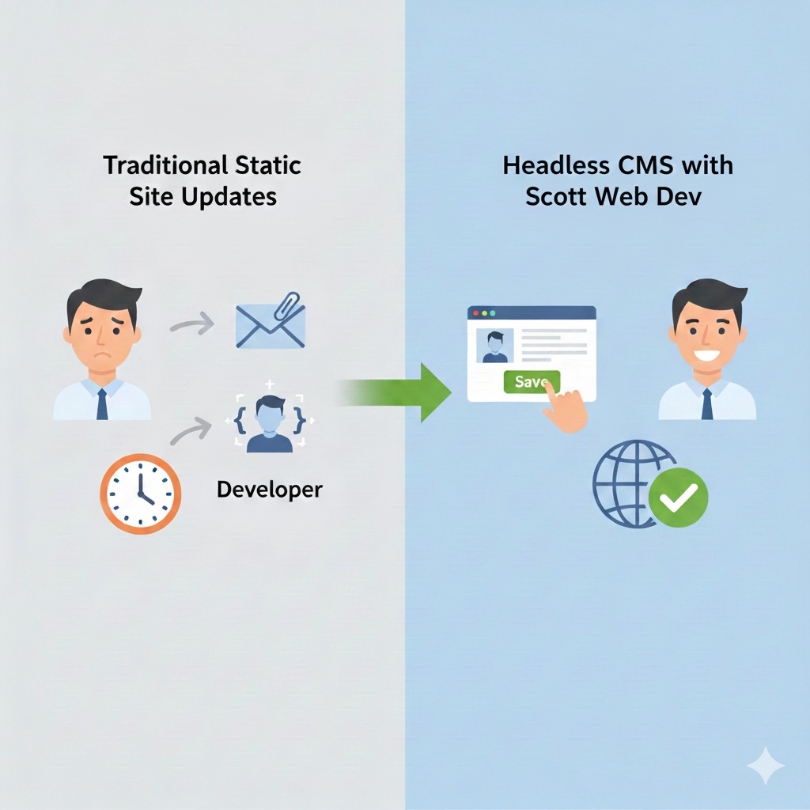
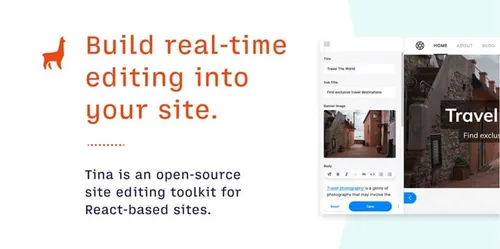

## The Client

[gpaconsulting.co.uk](https://www.gpaconsulting.co.uk) is a thriving Insurance Consultancy business based out of Rayleigh, Essex.

Their insurance auditing work is highly specialised, attracting client work from across the globe and spanning a wide range of Geographical locations.

After an initial consultation with the client, we decided on a design with a single-page scroll effect, such that all essential information is as centralised as possible.

## Tech Stack
### Front-End

With the intended function of the website being to serve static information about the business and their service offering, a [Static Website Generator](https://jamstack.org/glossary/ssg/) seemed like a natural choice for us, with [Hugo](https://gohugo.io) winning out over the competition.

_image credit_: [Netlify](https://www.netlify.com/blog/2020/04/14/what-is-a-static-site-generator-and-3-ways-to-find-the-best-one/)

Given Hugo's wide community adoption, and [mind-bending array of high-quality, free themes](https://themes.gohugo.io/), the client and I quickly managed to track down a high-quality, SEO-Optimised theme called [Hugo Scroll](https://github.com/zjedi/hugo-scroll).

### Back-End

Until recently, a **classical limitation** of Static Site websites has often been _updating content_: conventionally, because text copy was 'baked in' to Static Websites, having users adjust their own content without a developer's help was very difficult. In such a 'manual update' scenario, precious (and expensive!) developer time is spent manually copying and pasting text/image updates into the website code and liasing with non-technical stakeholders in order to verify the results on the final site.

Due to the growth of Static Site development through [JamStack](https://jamstack.org/) initiatives, a number of flexible admin solutions (known as Headless CMS) have emerged in the past decade, allowing the merchant to alter essential content on-the-fly, with site rebuilds triggered automatically 

A [wide range of CMS solutions exist](https://jamstack.org/headless-cms/), however in the case of [gpaconsulting.co.uk](https://www.gpaconsulting.co.uk/), we were looking for a simple, no-frills solution which didn't have a steep learning curve in order to get started. We opted for ['TinaCMS'](https://tina.io/), a basic admin package with extensibility to support [Cloud storage for images](https://tina.io/docs/reference/media/external/cloudinary) and lots of other clever stuff.

## The Result

[gpaconsulting.co.uk's](https://www.gpaconsulting.co.uk) new website is just the job - visually the content is clean and clear, and on the backend the client can update almost all written content on the site via the implemented [TinaCMS](https://tina.io/) admin system.

<video width=100% loop autoplay>
    <source src="./out.webm" type="video/webm">
   Your browser does not support the video tag 
</video>

Do you need some Web Development help with down-to-Earth advice and straigntforward solutions? [Book a free initial consultation call with me](https://calendly.com/scottwebdev-proton/30min), or email me at [scottwebdev@proton.me](mailto:scottwebdev@proton.me)