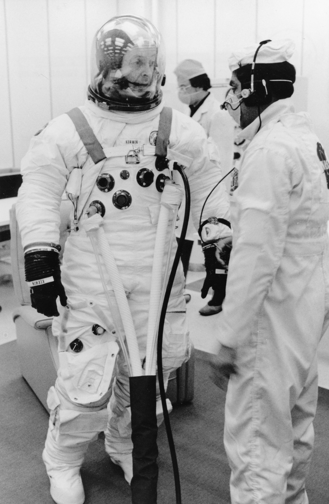

There I was on a dark Friday evening in an AirBnB near Canterbury center, preparing for an activity-filled weekend away with the family.

Unimpressed with the evenings' entertainment, I perused the single bookshelf above the dresser with a detached curisoity. Quickly enough, my eyes were quickly darted to the cover of a dated-looking volume:

**'Cheryl Currid's guide to Business Technology'**.

### Tech Time Capsule

Given it's appearance alone, I am quietly confident that no guest before me had given Ms. Currid's guide more than a second's glance. I could hardly blame them: aging pastel tones and an absurdist, cartoony illustration meant this book was clearly from a different time. 

Yet something in it's tired aethetic called to me, and implored me to open the cover...

## A modern time-capsule

Quaint visuals aside, Ms. Currid's _excited gesticulations_ about the **machines of yesteryear** started my cogs whirring. For every paragraph read there seemed to emerge _yet another_ uncanny parallel with the modern World and the emerging tech we regard so highly. Allow me to explain:

<!--The relationships humans develop with machine seem to form resounding echoes across the decades. Despite the chronological mismatch of reading about outdated technology from yesteryear, some of the realisations of similarity were quite astounding.
-->

<!--most people with even a smidgen of time-management faculty off. it's heartfelt pleas to educate me about the boundless intricacies of pagers and Fax Machines may have seen this publication sentenced to the bin or the local Barnardo's in most households. not this one. No, for some slightly absurd reason, the host had amalgamated 
-->

### The Great Race to Cyberspace

<i>Image credit: 'Navy Medicine' on <a href="https://unsplash.com/@navymedicine">Unsplash</a></i>

Currid's World of pre-Y2K technical pioneering knew the Internet as 'Cyberspace': an immeasurably vast expanse of uncharted digital territory. 

<!--Naturally, then, such an environment could be chock-full of technological marvels or nefarious emerging perils.-->

> Sooner or later nearly everyone who survives the learning curve of computers and communications is going to want to branch out - go beyond the PC, beyond the LAN, and beyond the office e-mail system. Curious people want to take that extra step and see what is on the other side of a modem.

Today, our modern societies are inextricably embroiled with a surge of potent A.I technologies - citizens young and old are being _forced to confront_ this monumental advancement in I.T technology with a view of survival in their respective field or industry. This pattern is likely to dramatically shape society for generations to come. 

Figuratively speaking, it is possible to observe clear parallels between an individual's first venture into 'Cyberspace' (as Currid illustrates above) and _somebody's first experiences with A.I LLMs_. **Can you remember how you felt the first time you opened ChatGPT?** _a blinking cursor_, _the hastily-typed query_ and _a pause with baited breath_ whilst a _humanoid-sounding thing behind the screen starts writing back_.

> Sound good? Sure, but for business people expecting to stay on top of their field, cyberspace is more than just a place to satisfy intellectual curiosity. In fact, already for some, it is necessary to make a daily trek somewhere into the Internet or commercial online services to research facts or look for news.

Similarly to the first generations experiencing the internet, the progression seen within technologies like Large Language models that gather such global acclaim is that their usage becomes rapidly embedded in almost every facet of life, from work to play.

In the same way that it might sound unthinkable today to imagine a phone without [mobile data capabilities](https://www.techtarget.com/searchmobilecomputing/definition/4G), so too might it be unthinkable to conduct our work life without the assistance of Machine Learning chatbots in the future. Even job roles we consider to be completely analogue (such as a Car Mechanic or a Barista) may eventually be mediated with monitoring and support from learning algorithms on a day-to-day basis.

<!--Drawn to the text by a sense of morbid curiosity coupled with romanticised nostalgia for the everyday norms and household devices I once knew, I soon began to identify uncanny parallels in the explanations and guidance used for machines and programs that time has long forgotten and the platforms and products most of us consider cutting edge today.-->

### 'Tips for Using Cellular phones'

For many mobile phones have, for the most part, maintained pride of place with a business context, however with the advent of the new Millenium, the dawn of asynchronous communication via email and Instant messaging services revolutionsed how many professionals conduct their daily business.

Tentatively absorbing Currid's writings about communication ettiquette without any reference to messaging in text form felt very strange initially. Nonetheless, email itself is not without it's flaws, and these two distinctly seperate communication methods eventually married up neatly on some key points:

> **Don't say anything you would not tell your grandmother.** Cellular phone conversations are not secure. Low-cost scanning devices can easily pick up your conversation, your phone number, as well as all the phone numbers that you dial.

_Mum's the word_.

Many people (including people in I.T who should know better) forget that email services are [without robust means of encryption](https://www.microsoft.com/en-us/security/business/security-101/what-is-email-encryption), employing only a rudimentary form of message encryption known as '_opportunistic_ TLS' which means that messages receive basic encryption **only if both the outbound and inbound mail server support it**. As a result, sensitive details sent by email are **highly vulnerable to interception by malicious actors**. 

The importance of avoiding email for transferring sensitive documents and material cannot be overstated, and is part of the reason that Cloud file-Storage solutons such as [Google Drive](drive.google.com) are so prevalent in the World today.

#### Voice-mail

> Your voice mail box is like your voice valet. It is there to help you when you need it. It will greet your callers with a recorded message when you are busy or cannot or do not choose to answer the phone.

As fickle as it may sound to some readers, the concept of 'keeping it short and sweet' correlates so well with making decisions and producing content for your Social Media channels - in much the same way that a prospective client of yours may feel exasperated by a long preamble on your answer-machine box in the early 'noughties, so too do the wildly overstimulated users of Social media who _just want you to get to the point_ so they can get on with their day.

! [A photo of a side within the book with illustrations](./CHERYL_C_3237.PNG)

<!--been enough to ith the and lone on the front page alone should have been enough to scare me off of being sucked-->

### Don't fall for yesterday's mistakes

So, in the end Ms. Currid's plethora of musings about technology came in very handy indeed, providing me not only fuel to the fire in my esoteric writings about technology, but also in elucidating how closely specific patterns of social norm repeat themselves within the context of adopting of new technologies.

Whilst Currid's book details outdated machines (i.e: Fax), the likes of whom are potentially now only fit for the recycling center, it is always worth looking back at the wisdom of those technological challenges that preceded our own in order to gain a deeper appreciation for the wisdom of how to avoid some of blunders made by our forerunners.
