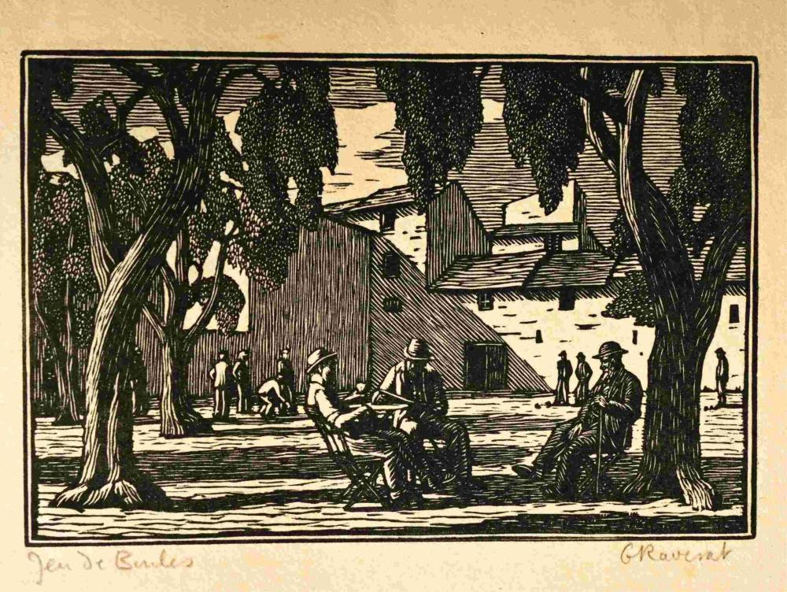

As the possibilities of A.I grow and [Large Language models](https://www.cloudflare.com/en-gb/learning/ai/what-is-large-language-model/) (LLMs) become progressively more accurate, a new paradigm is emerging in modern business: a large-scale shift towards A.I-generated design and written content production, at the detriment of classical human craftmanship. The scale of this shift is unprecedented: according to [colorwhistle.com](https://colorwhistle.com/statistics-ai-content/), as many as 67% of small business owners are using A.I to generate their content online.

In the U.K, [surveys by the UK's Office for National Statistics](https://www.ons.gov.uk/peoplepopulationandcommunity/wellbeing/datasets/publicopinionsandsocialtrendsgreatbritainartificialintelligenceai) have shown a gradual but consitient growth in optimism towards A.I technologies, wheras a [worldwide independent survey](https://static.googleusercontent.com/media/publicpolicy.google/en//resources/ipsos_google_our-life-with-ai_2024_25.pdf) commissioned by Google reported that between 2023 and 2024, all major economic regions (and developing regions) witnessed at least an 8% increase in A.I usage.

As many of us invites superintelligent algorithms into decision making processes within both our personal and professional lives then, what subtle cues can we identify which may indicate that our thought processes have gone astray? Are there clues we can look for which show that we have gotten off track, be it from personal biases, or biases within the LLM model itself? 

<!--how can we be mindful that we do not offset our own decision-making authority through an overreliance on A.I tools? What subtle factors might be leading us astray in our quest to become more efficient in our work? The crucial term which is emerging in today's research into LLM's is that of bias - both from the machine and in our own minds.-->

### Why LLMs

LLMs (i.e: [Large Language Models](https://www.ibm.com/think/topics/large-language-models)) interpret text written by humans (in their natural style of communication), and provide an output written in a similarly humanisitic communication style.

LLMs have fast response times, a high degree of accuracy, and provide relevant information even within nuanced, detailed contexts. Providers like [OpenAI's ChatGPT](https://openai.com/) and [Anthropic's Claude](https://claude.ai/login) offer basic versions of their service for free, with premium subscriptions available for those who want to access a higher level of reasoning skill.

LLMs (like the human counterparts they mimic), are susceptible to a subtle but insidious plague: bias. Bias could be introduced through multiple mechanics, for instance:

- A pre-disposed way of thinking in the user writing the prompt
- Un-mitigated instance of opinionated material in LLM training data

### What is bias?

'Bias' derives [from the middle French](https://www.etymonline.com/word/bias) 'biasis', defined as "a slant", "a slope", or "an oblique".

In the 21st century, however, most people would articulate bias in much more concrete terms, for instance:

> a systematic deviation from neutrality, arising from the subjective perspectives, beliefs, values, or agendas

_credit: [CLRN](https://www.clrn.org/what-is-bias-in-history/)

In the 21st century, huge swathes of modern science is devoted to the pursuit of  

The effects of psychological bias itself are too vast to mention. 

The term 'bias' would grow to become a pivotal term for many areas of modern Science, from the natural sciences (i.e: to identifying unfair conditions or lack of objectivity in proving a theory), through to Psychology, where the identification of bias in the mind of a patient can help to understand the mechanics of problems such as addiction or 

of an over-reliance on that we maintain a balanced mindset in the decisions we make whilst in regular contact with machine-learning algorithms?

The crucial word to note here errors and assumptions are happening under the surface.

## 1. Cognitive biases

> "Cognitive biases are systematic tendencies leading
to error – such as the tendency to interpret infor-
mation in a way that confirms and reinforces pre-
existing beliefs and opinions"

Large Language models use a knowledge base sourced from the entirety of the web

### A report is due

A purely mathematical stance on the concept of human productivity would lead us to believe that Large Language Models will automatically fractionalise production time on essential work tasks by diminishing the amount of human effort required at each stage of a given task or assignment.

To better convey this idea, let's present a hypothetical situation which exemplifies some of these characteristics. Using a _loose interpretation_ of the [GHERKIN](https://cucumber.io/docs/gherkin/reference) framework, let's present a concrete scenario where Large Language Models are used:

**TASK** 'Jeff' is assigned to produce a report on 'Current market trends within the commercial sector of Basketball Footwear' within the time-frame of 72 hours
**GIVEN** 'Jeff' has access to the internet: a _virtually limitless_ resource of information on _almost any_ topic
**AND** 'Jeff' chooses Large Language Models in order to produce the report
**WHEN** Jeff starts working on his report
**THEN** time spent planning the necessary components of the report will be reduced by a factor of A (Large Language Models have the ability to help users plan towards a specific goal and understand contextual markers in order to tailor guidance towards a specific situation)
**AND** time spent researching relevant informative materials to create the factual basis for the report will be reduced by a factor of B (Large Language Models are trained upon a huge range of available data, including resources such as academic papers written in highly sophisticated language)
**AND** time spent writing and formatting the report will be reduced by a factor of C (Large Language Models are able to respond to instructions to create bespoke documents based upon layered instructions and granular criteria)

**disclaimer:** This is definitely not a correct implementation of the GHERKIN method 🙂

This simplistic example presents an unambiguous picture of what _should_ happen when LLM tools are employed in the context of a real-world task. It is conceivable that 'Jeff' really does find himself outputting the report at an earlier date. But let's play devil's advocate for a moment with the _often highly unpredictable_ facets of the human mind.

#### Overestimation Bias

When we are presented with problem (i.e: producing a report), our highly complex, highly sensitive human brains are likely to produce a great many psychological distortions, for instance: if we are presented a task where the underlying problem we need to solve is rooted within Mathematics, and we believe ourselves to be good with numbers, we are very likely to inflate our estimations of how likely we will be to solve such a problem.

A famous precedent in psychological research mirrors this narrative: the ['Dunning-Kruger effect']. In 1999, researchers David Dunning and Justin Kruger of Cornell University in America, produced researche that in a general sense people inherently hold overly favorable views of their abilities across different domains.

Whilst the academic efforts of Kruger-Dunning exclusively addressed concerns of self-assessment within the bounds of a task in controlled conditions; my own forays into research on the psychological effect of Large Language Models came up fruitless in searching for identified psychological effects of LLMs upon our own assessment of academic ability, likely due to the relative infancy of LLMs as a techology. Despite the lack of supporting evidence, I strongly suspect this to be a significant factor in actual efficiency and effectiveness for completing tasks with A.I assistance.

of humans augmenting their cognitive abilities with the use of LLMs. I believe this effect to be dramatic in producing psychological distortions, especially within the realms of self-evaluation. I predict that this  augementing humans' natural intelligence with LLM capabilities. To me, this is a pressing 

But in a different vein, what psychological distortions can we expect when we estimate our abilities to succeed at a task when employing the assistance of a super-intelligent automated assistant, versus without one? What oversights and 

If left unnattended, these distortions can lead to dramatic lapses in judgement and ultimately oversight or failures in specific areas. One such distortion is known as 

Whilst the Dunning-Kruger effect focusses specifically upon existing competencies, I believe that our natural disposition to inflate our own abilities may be further skewed by the novel abilities of Large Language Models, causing us to mismanage time, over-analyse and 

 If we assume that Large Language Models are abundantly available and assumed to be used within the context of such a simplistic task, I believe that the innate psychological dispositions of humans will skew this picture significantly. As a result, here is a counter-proposition of the same situation I'd like to present to provide a more balanced view of a **real** humanistic reaction to 

For the avoidance of doubt, let's assume that we are talking about tasks within a professional context (i.e: tasks which humans **must** )
## 3. Inertia from abandoning existing ideas

## The fight for authenticity

To help illustrate why humans can _still_ write better than A.I, I would like to turn to the concept of ['Uncanny Valley'](https://www.britannica.com/topic/uncanny-valley) - a psychological phenomenon coined by Japanese Professor Masahiro Mori, who measured the emotional reaction of human subjects to the faces of progressively more human-looking android robots.

- Human writing is clearly distinguishable, because it has texture
- Well-crafted human can evoke intense emotional reaction, be it surprise, anger, disgust or sympathy
- ***Humans can be bolder***

hiring a human to produce you a logo, write up a blog post or to get the styling of your Website just right might seem costly and unimportant.

Certainly, a lot of highly 

Investing in human-led design and marketing shows your customer base that:

- You care about authenticity: you aren't content with just using machines to generate information about your services, values and ideals
- You seek to provide your customers with a unique experience, because you care about what you do and you want to go the extra mile
- 

It sends a clear message to your customers that you are willing to meet them authentically, treating them as unique individuals. In an age where chatbots have been assigned the task of invading the territory of Artists Investing in design created by humans shows that you truly care

To invest in the Arts in a time of political uncertainty is an act of grace - a token of acknowledgement that all too often the solution to our material woes as mortal beings all too often lies within the abstract.

Investing in the Arts as the World heats up

has given rise to tech CEO billionares hell-bent on training inspid neural networks to produce detailed parodies of human expression. 

If you are someone who (dares) waves the brush, inks the roller or produces a melody, Big Tech wants your resignation on the table by Monday morning.

In this time of political uncertainty and warped Investing in Art is an act of rebellion. A gesture of defiance. A 

At a time when chatbots can
