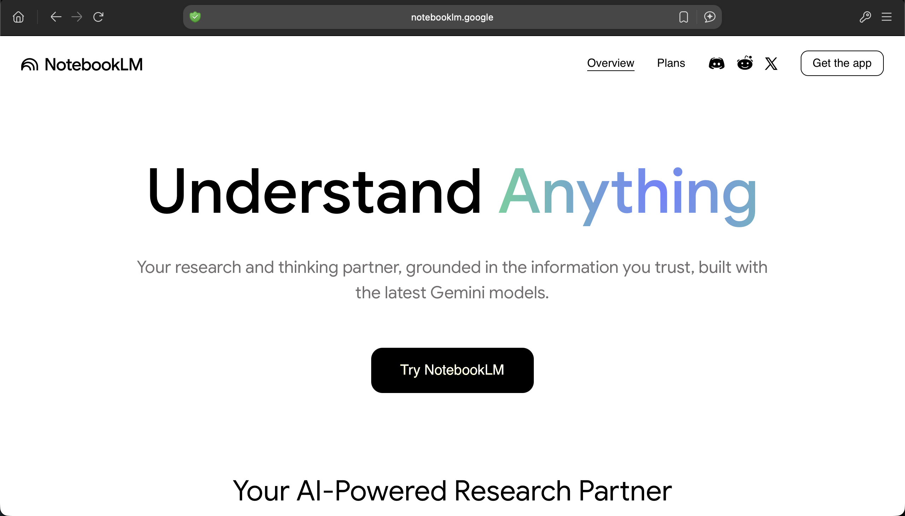
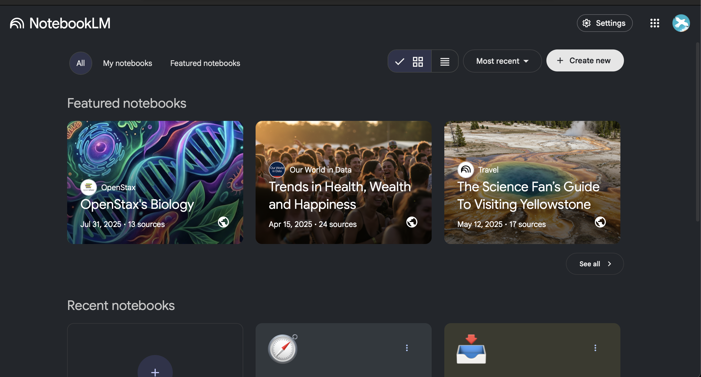
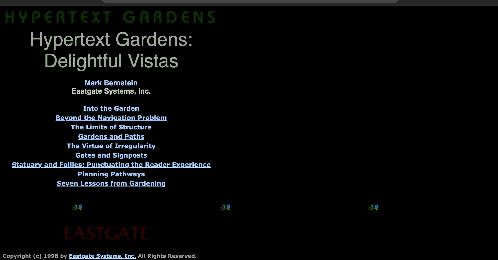

### The A.I Zeitgeist

I have spent far too much time on LinkedIn recently. Attempting to promote my Web Development and Web Admin Education service, scottwebdev.net, I have weathered post after furious post in seemingly endless storm of competing pro-or-anti A.I. rhetorics on my Newsfeed.

*Image by Hector John Perquin via Unsplash.com (unsplash.com/@hectorjp)*

With a deep passion for writing articles, however, much of these ramblings are fuel to the fire. In my explorations, I have frequently found myself losing track of fascinating little excerpts and tidbits which carry the seedlings of inspiration for fully-formed pieces.

> "Could this be the tool I need to finally get my facts straight and write more effortlessly?"

The tool so profusely recommended by my friend was NotebookLM, toted by Google as next best thing since sliced bread.

### Your shiny, new, A.I-powered ‘Research and Thinking Assistant’

…or at least, that is the full-caps, extra-bold slogan emblazoned boldly on the homepage of Google’s designated site for the tool.

*NotebookLM’s homepage (https://notebooklm.google)*

Side-stepping the glossy marketing spiel on the site's homepage, press the big, not-red button labelled ‘Try NotebookLM’ to reach maximum velocity. Here you can dive straight in and explore what this ‘thinking assistant’ is really good for.

### The interface

When opening up the interface, the first thing you will notice are a bunch of recommended repositories referencing topical, relevant subjects such as current geopolitical events, scientific advances and academic breakthroughs.

*A screenshot of the NotebookLM homepage*

These rich, juicy topics full of compiled resources can be alluring to explore, but personally, diving in at the deep end is where there is the most to gain: I encourage any first-time users to muster their courage and hit the ominous-looking ‘create new notebook’ button.

### A voyage into the unknown

My first exploration with NotebookLM started with a bit of a brainwave after a long car journey. I had just recorded a long and emotionally-charged ‘audio log’ recording my mental reaction to lengthy discussion about my companies’ service offering. The voice note laid out the associated feelings it brought up in me and my own rationale for the internal resistances I experienced to the advice imparted.

After Air-dropping the file to my Computer, I was excited to see that I could add voice notes a NotebookLM ‘Source’. The conversation with the learning assistant begins here, however at this stage I had yet to provide my 'research assistant’ with material of significant depth - the chat function was mostly re-iterating parts of my mildly irate voice note back to me.

*An example project pane within the NotebookLM app, based around the theme of understanding the WCAG 2.0*

Suddently, I felt inspiration start to take root as almost organically inspiration for source material began flooding in. Before long the ’Sources’ pane was awash with artefacts of my slightly befuddled business journey so far, including:

*   scottwebdev.net - my personal website URL
*   a previously unfinished business plan document
*   Links to events I had attempted launch on EventBrite
*   An intro video about my services I had originally recorded for fiverr.com

A realisation sprung to mind, courtesy of a memory I had of an episode of The Informed Life Podcast with industry-renowned researcher Maggie Appleton.

### Digital Gardening

This podcast episode engages Maggie at length about her colourful career and her championing of the 'Digital Garden’ concept: a digital resource wherein the curator/s grow and attend a set of interconnected, ever-evolving notes, musings and articles on a specific subject. By nature of it’s interconnectedness, as information is added and updated, ideas naturally emerge and gradually expands, morphing into new structures as it does so.

*Image from Shawn via Unsplash (unsplash.com/@shawnanggg*

A key part of Digital Gardening is resisting the urge to ‘polish’ the texts you produce. At least initially, a new document (or ’seedling’) should be written as though writing a personal reference to yourself. In such cases, it is only natural to feel self-conscious about who might be reading, so to try to eschew such anxieties I reassure myself like so:

*   few could find my ‘patch’ and those who do most would likely be forgiving.
*   The composition and style of writing might actually resonate with others who have a similar learning style to me

> A digital garden is an online space at the intersection of a notebook and a blog, where digital gardeners share seeds of thoughts to be cultivated in public.

Digital Gardens are constantly in a state of flux - intentionally so. The 'gardening' analogy is intentional, with visitors witnessing the growth of your resource on a frame-by-frame basis. Unlike conventional blogs, there lies a risk of over-working articles or posts, the principle of 'Digital Gardening' invites you to lay it bare for all to see, cracks and crevices to boot.

In her own write-up of Digital Gardening, Maggie Appleton credits Mark Bernstein as the original pioneer of Digital Gardening, citing ‘Delightful Vistas’ - a visual essay about the paradigm of structure within websites and Hypertext documents.

### “Delightful Vistas”

‘Delightful Vistas’ analogises hypertext documents as 3D space, characterising uniform, regimental structures as ‘streetscape and corporate office: simple, orderly, unsurprising’.

Conversely, unwieldy or haphazard arrangements of data are represented as ‘wilderness’, proffering that ‘Interesting things await us in the thickets, but we may be reluctant to plough through the brush, subject to thorns and mosquitoes.'

*The ‘Delightful Vistas’ homepage on the website for Eastgate Systems, owned by Mark Bernstein*

### Breaking the 4th wall

In many respects, then, Google's NotebookLM adds a 4th dimension to the idea of websites as 3D, navigable space. Now, instead of emerging from a website covered with scratches and bruises from untamed lexical thicket, you have a new, attractive alternative - your own, personalised guided tour of the digital landscape within which you have found yourself.

What's more, by adding data sources and notes of your own to the mix (or indeed supporting your original findings with additional files or webpages) you exercise your ability to morph the fabric of this digital environment to your very will. NotebookLM allows you to generate your very own artefacts.

Uploading that hastily-recorded voice note made in McDonald's drive-thru can transmute perceived deranged ramblings into a valuable rudder with which to steer your mind-vessel towards intellectual booty - giving your 'virtual guide’ important clues about where to go.

Try it out for yourself, and leave a comment about the topic you chose to investigate!