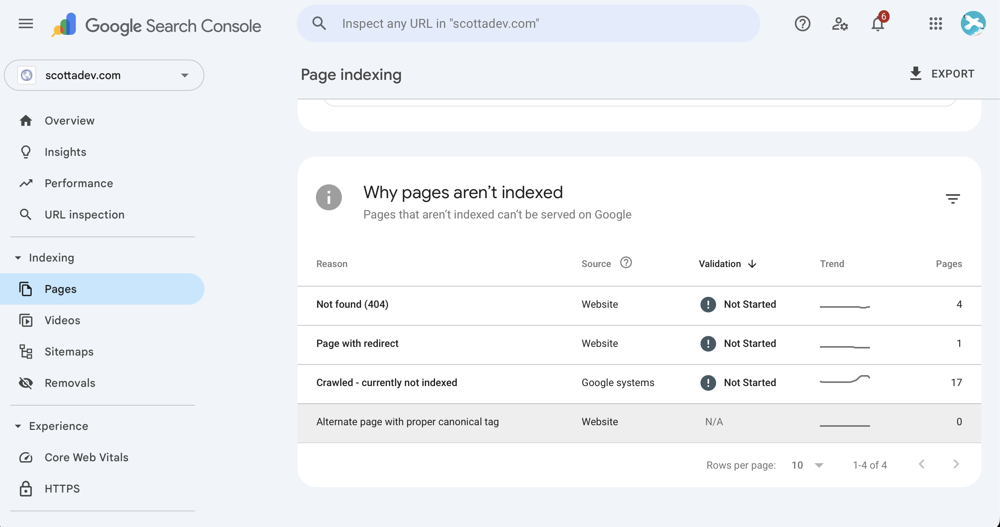

Chances are, you've heard of Google. The probability that you understand how it's Search Algorithm works, however? Less likely.

<!-- The pursuit of achieving pole position within Search Engine Result pages ([SERPs](https://www.semrush.com/blog/serp/)) dates back to before the Millenium. According to the annals of internet folklore, the inception of the term 'Search Engine Optimisation' was catalysed by a near-mythological phone call between the band manager of [Jefferson Starship](https://www.jeffersonstarship.com/) and a VP at a Web Development company, Cybernautics. 
-->

These days, the science of search rankings is a discipline unto itself, namely ['SEO'](https://www.searchenginejournal.com/seo/seo-history/) (or Search Engine Optimisation). For most people (myself included), realising the complete picture of how Search Engines work is a time-consuming and thoroughly overwhelming task - it would consume way more spare time than they have free.

## What's the alternative, then?

Happily, there are some awesome, straightforward (and predominantly free-to-use) SEO tools out there which can get us on the right track. From there, we can lay the foundations to success at astonishing rate. Let's lay the bedrock to get you on the map. 

<!-- Most people have heard of SEO. Most business owners with a forward-thinking mindset have likely attempted to improve their search engaine rankings at some stage.

Despite this, gaining a basic understanding of the simple SEO concepts can which help your website can be a cryptic maze of Jargon-based rabbit holes. -->

### Google Search Console

#### Difficulty: beginner

Before concerning ourselves with the intricacies of influencing a website's search rankings, we must get pages noticed by Google's Search Algorithm. This process is called ['Indexing'](https://developers.google.com/search/docs/fundamentals/how-search-works#indexing).

To aid us in navigating the many possible pitfalls which could prevent web pages from getting picked up properly by Google Search, Google released it's very own tool called ['Google Search Console'](https://search.google.com/search-console/about).

Google Search Console acts similar to that of a basic 'Website Health Check' inspecting your website for detractors which will significantly affect performance or even just general rankings!. After a [brief process of verifying site ownership](https://support.google.com/webmasters/answer/9128669), GSC provides a crucial snapshot of website 'vital signs'.

### Google PageSpeed

#### Difficulty: beginner

Google PageSpeed helps digest the fundamental aspects of User Experience on your website (as according to Google's [Core Web Vitals](https://web.dev/articles/vitals#core-web-vitals)). 

The Core Web Vitals system ([LCP](https://web.dev/articles/lcp), [CLS](https://web.dev/articles/cls) and [INP](https://web.dev/articles/inp)) is a performance metric system specifically designed by Google to help ensure make websites load faster, are accessible for a wider range of people and are generally more responsive for users.

In trying to improve scores across all 3 metrics, not only can you improve your likelihood of getting a good spot on the results page, but you also make your website a heap more usable. As a tool, Pagespeed can be invaluable simply for sanity-checking the user experience of various pages within my site, providing simple guidance to make my site just that little bit better!

<!-- What's more, you don't have to understand a single line of code!

It's function as a tool is contingent upon helping websites to conform to the of [Core Web Vitals](https://web.dev/articles/vitals#core-web-vitals) system - a 
-->

### PeopleAlsoAsked.com

#### Difficulty: intermediate

As mentioned in the introduction, the World of SEO can be labyrinthine. Nonetheless when writing content, a little knowledge of what will gain kudos from the algorithm can go a long way.

The bedrock of getting content ranked within Search Engines is keywords. That said, if you just splatter around generic keywords related to your industry or target audience in your finely-crafted article of blog post you are looking for trouble, and Search engines will sniff you out

When crafting content for the web it pays to think like someone in your target audience - someone who you think would really 'get' you and resonate with your style. In identifying this person (encapsulated within a larger topic called '[persona mapping](https://targetinternet.com/resources/tips-and-tools-for-creating-marketing-personas/)'), we need to understand the kinds of lifestyle factors this person lives with, and therefore the kinds of searches they might make on a day-to-day basis. Niche, unique searches that only 'your' people would make are golden, and will win you tons of authority and click-throughs.

In exploring what a target audience might search for, I love to explore 'People Also Asked' - a site which helps you visualise the different variants of a specific search which are regularly made, or just searches directly adjacent to the current query. As a side note it can often be fascinating to witness just what kinds of searches people really make!

### In summation

Well, that's all (for now at least). I hope this article instilled in you at least a little bit of courage and mental fortitude with which to go forth into the big bad World of Search Engine Optimisation and really stake your claim. As with many goals in life, getting started can be half the battle.

If you need any tips, clarifications or general guidance on the material in this article, please feel to reach out to me at [hello@scottwebdev.com](mailto:scottwebdev@proton.me)
