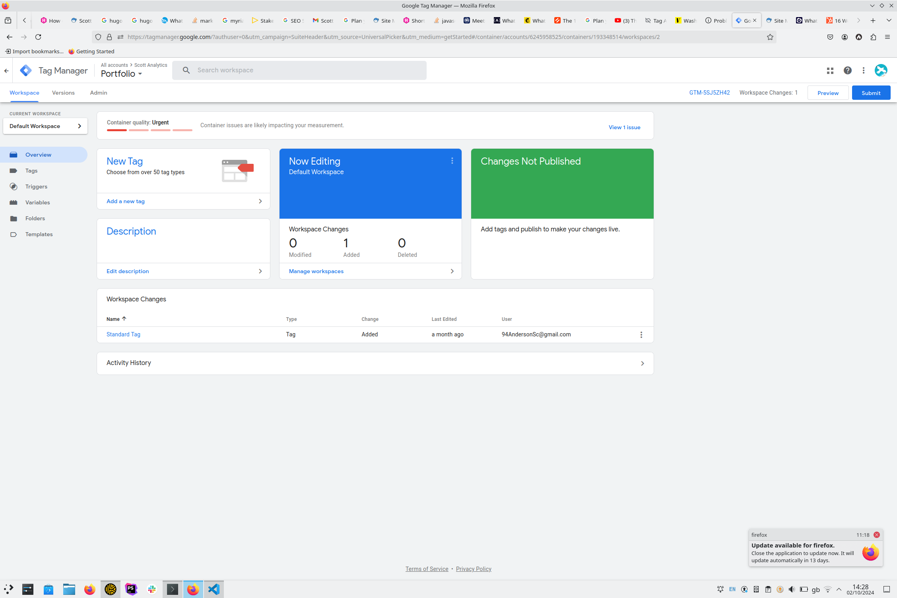
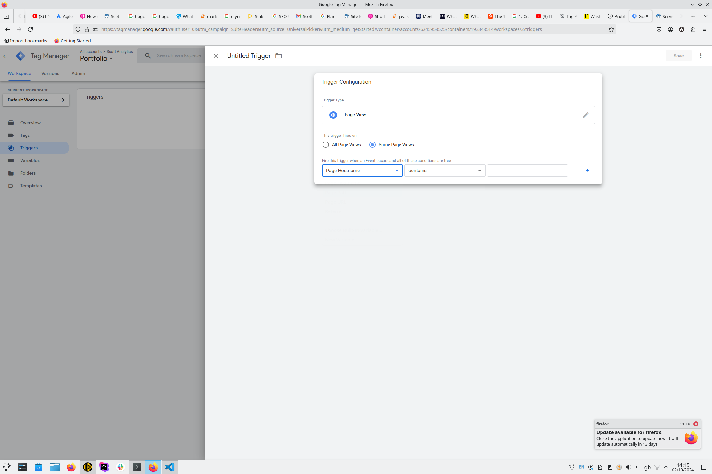
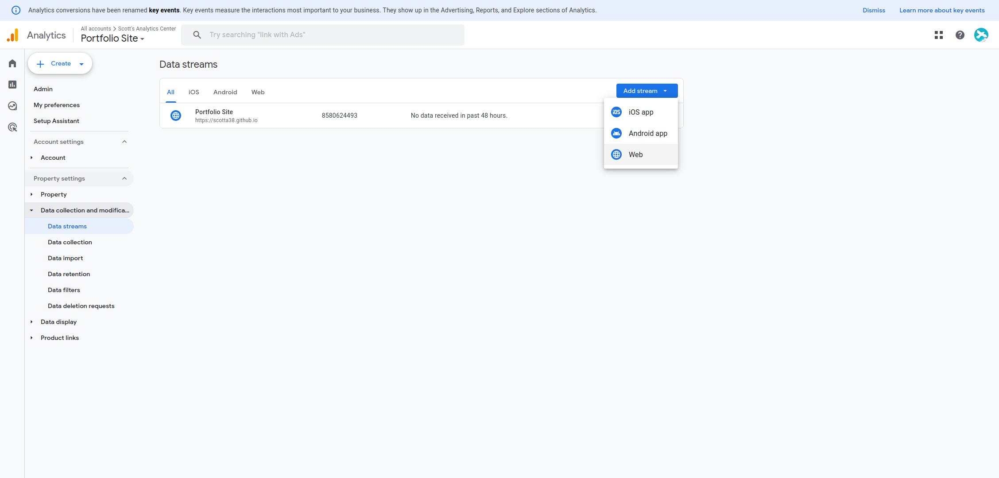
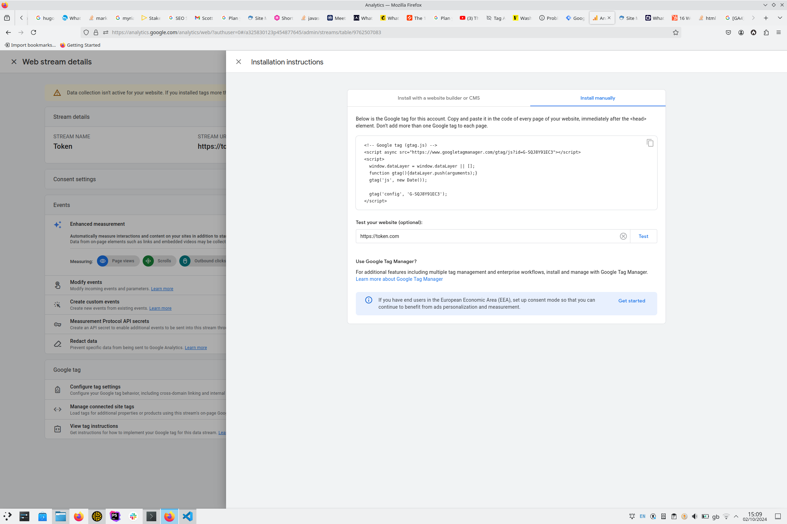

### All systems go

You've done it. After countless late nights and many chewed fingernails you are ready to launch your beautiful new site. Nervously pushing the deploy button, you marvel at the new opportunities that may lay ahead. 

After a few weeks, however, your inbox is empty and there are no new sales to report; your new site is not delivering as you expected and web traffic seems to be non-existent. At this point, it seems logical to brand your efforts a failure, and pull the plug on the project. Don't give up yet - there are ways to  remedy a stagnant site - herein lies a great opportunity to level up your development game and learn how to keep tabs on your site's performance for engagement.

### A pain in the bottle-neck

Launching a new website is a complicated endeavour, and it only takes one issue to throw a spanner in the works. Here are some common reasons for site underperformance following launch:

- Bad [SEO](https://developers.google.com/search/docs/fundamentals/seo-starter-guide) rankings (how your site is positioned in search results)
- [User flow bottlenecks](https://www.linkedin.com/advice/0/how-can-you-identify-bottlenecks-user-flow-skills-user-research-vmiof)
- Slow hosting providers
- [Bugs](https://www.techopedia.com/definition/24864/software-bug) or defects in the site's code
- Display issues caused by lack of [cross-browser compatibility](https://www.freecodecamp.org/news/what-is-cross-browser-compatibility/) in your code

With all of the above potential pitfalls, it is important to have a firm grasp of how your site is performing, but as users visit your site, their information is often protected by their browser - how can you identify how they are interacting with your site unless you are watching their browsing session over their shoulder?

### On track for success

Here's the good news, there are many site analytics tools to help you understand how users interact with your website, for example:
- [Google Analytics](https://developers.google.com/analytics) - Analysis of event driven interactions in your website, such as clicking links, navigating to a new page, sales conversions etc.
- [Hotjar](https://www.hotjar.com/) - A UI-focussed analysis tool which provides services such as [page heatmaps](https://www.hotjar.com/product/heatmaps/) and [screen recordings](https://www.hotjar.com/product/recordings/) of user sessions.
- [Matomo](https://matomo.org/) - A data-privacy sensitive version of Google Analytics, which allows users to keep the data they track and their users privacy intact without Google or other companies snooping into your dealings

For the purposes of this article, I will give a brief overview of the baby steps involved in getting [Google Analytics](https://developers.google.com/analytics) up and running, mainly due to it's ubiquity in modern web development practises. For a more comprehensive guide refer to the [official documentation](https://support.google.com/analytics/answer/9304153?hl=en).

For those not already familiar with Google Analytics, this tool measures interaction with your site on a huge range of factors. Before you dive into setting up your account and adding code to your website, it is always a good idea to spell out what benchmarks you want to monitor on your site. Here are a few examples (with some help from the [Google Documentation](https://developers.google.com/tag-platform/devguides/prerequisites?_gl=1*1psp3uu*_up*MQ..*_ga*NTI2NjUyMjExLjE3Mjc4NzUxMDU.*_ga_XC1H1E07KE*MTcyNzg3NTEwNC4xLjAuMTcyNzg3NTEwNC4wLjAuMA..)):

- How many site visits are from Social Media posts and how many are from Search Engine recommendations
- How many site visits result in cart checkouts
- What the optimal placement of user interface elements is for the highest conversion probability
- Which products fare best in the ecommerce funnel of the website
- What actions typically precede a successful conversion

Try to write out a complete list of things you would ideally like to track on your website, and read some guides about Website metrics, for instance HubSpot has [an article](https://blog.hubspot.com/website/engagement-metrics) which covers some basics.

### Tips and Me-trics

The fundamental basis of the Google Analytics platform are [Tags](https://developers.google.com/tag-platform/devguides), which help monitor the events that happen on your website. This means that as well as setting up your website to communicate with Google Analytics, you also need to have some level of interaction with the Google Tag Manager interface [*](#footnotes).

Including Google Analytics in your site will involve adding just 2 code snippets, or if you are a more confident programmer you can utilise gtag.js, and write your tags in manually within `<script>` segments. For the purposes of this guide we will use the latter.

The Google Tag Manager interface (once you have set up your account), should look something like this:

From here you can define custom tags: think of a tag as simply a container for a collection of metrics you want to group, such as site traffic tracking.

A Tag would be functionless just on it's own, and requires a set of '[triggers](https://support.google.com/tagmanager/answer/7679316?hl=en)' in order to actually target user activity. See below for an example of setting up one such trigger for page views.

Jumping back over to the Google Analytics dashboard, we can navigate to 'Admin' (bottom left of the sidebar), and 'Data Streams'. Within the Data Streams menu we have an option to create a new Data Stream for our Website:

Once you have created a data stream, entering the appropriate information about your site, you will be presented with a custom code snippet with your Google Tag Manager ID which you must input on every page in your website. If you are using a templating engine in your site, such as [twig](https://twig.symfony.com/) or [pug](https://pugjs.org/api/getting-started.html), there may be a base template you can access in order to globally add this code to every page, otherwise go to town on the 'ol copy and paste routine for each page in your site.

These insights can in turn inform improvements which will take your site up the Search Engine ranking ladder. Not only this, by tracking the navigation of users with anonymised data, you can identify common trends in the [user journey](https://mailchimp.com/resources/user-journey/) across your site, enabling you to focus on a specific part of the website that is causing friction with online sales.

### Wrap-up

When creating a website, however great, beautiful or functional it may be, there are always likely to be teething problems with it's launch. Forseeing, or even detecting these problems can be hard, which is why it is key to understand how users interact with your site, as the reality may be shockingly different to your mental picture when you designed/coded your pages.

Google Analytics is a tool purpose-built for helping you to understand how users interact with your website, from seeing how many sales conversions you get from a email link, to understanding how much of a video on the hommepage a user typically watches. The sky is the limit.

#### Footnotes

\* If you are using a CMS such as Wordpress or Drupal, a couple of 