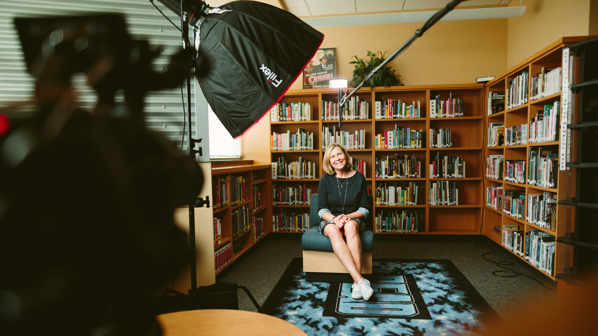

At Scott Web Dev, we specialise in robust, fast & reliable websites.

## What makes our websites different?

Scott Web Dev specialises in the production of **high-fidelity static websites** using a set of principles known as the [JamStack](https://jamstack.org/) approach.

[JamStack](https://jamstack.org) websites are highly efficient. This is because they **dramatically reduce the amount of code** which needs to be executed on a web server in order to see your page on your screen. As a reusult, they are typically _lightning-fast_ to load, _highly secure_ and _very cost-effective_ to produce.

<!-- Theyan web development approach which is centred around reducing the complexity of the make-up of a website, such that webpages can be delivered more quickly, the browsing experience for web users is more secure (due to a loac) -->

## About You

When creating a new website for a client, the first part of the jigsaw puzzle is to meet with you.

<i>Image credit: <a href="https://unsplash.com/photos/woman-sitting-on-armless-chair-with-light-between-bookcases-in-room-4siwRamtFAk">Sam Mcghee on Unsplash</a></i>

<!-- In my experience,  -->

Time invested in getting to get to know the real you is time well spent.

I _prepend_ any website development work I do by **developing a strong picture** of **who you are** and **what you stand for**. This helps me be truly effective for your business, understanding the _ins_ and _outs_ of how to **deliver best for you**.

<!-- to meet your needs and to **send an authentic virtual message to the World**. -->

Your website represents a **virtual window into your World**, and it is of _crucial importance_ to treat it with care.

<!-- This 'virtual porthole' often opens up first contact your potential clients, providing them key insight into the mission of your business and the ways in ways in which you can deliver for them - if it's not moving people towards **clear, unambiguous insight** about _who you are_ and _why you're different_, then it's not working! -->

<!-- with a fair and accurate account of your story to date, arming potential customers with **** into the ethos of _how you work_ and _why it's different_. -->

<!-- Your website should be something you cherish and present with confidence, not something that hides away at the bottom of an email footer! -->

This phase of the process is not just a nicety, it is **a key foundation for our project**, allowing us to align as people and agree upon what features are an 'absolute yes!' and which aspects are definitely a 'hard no!

<!-- a good old chinwag, I can learn a bit about your story as a business so far, engage deeply in understanding the challenges unique to you in your daily work and visualise how I can make an effective statement for you or your team. -->

<!-- This intial phase of the process allows me to get a better picture of the person behind the name and allow me to help create an authentic view of your -->

### Design

Think of the design phase like a sort _'creative fact-finding mission'_, where I grab a variety of options off a fictional clothes rail, allowing you time to try on the garments that speak to you the most and settle on a fit that suits you the best _(given the likely agreement of some alterations)_.

<i>Image source: <a href="https://unsplash.com/@fujiphilm">Fujiphilm on Unsplash</a></i>

To faciliate this, we will begin by browsing online catalogues for options for a theme (for instance [Hugo Themes](https://themes.gohugo.io/), if we are working on a [Static Site](https://www.geeksforgeeks.org/websites-apps/static-vs-dynamic-website/) together)



Go with your gut, and let your senses guide you.

When **selecting your _base_ theme**, try not to think too closely about the pre-existing colour scheme of the design, any extraneous text or missing functionalities that you would like - I am always on hand to provide expert alterations (and indeed, extra features) as desired during the Development phase.

### Development

<!-- shape that you want your site to take -->

After _communicating closely_ on the project vision, we now have **clear alignment** about the _route to run_, what _technological hurdles might be encountered_ along the way and finally _what resources we need_ to cross the finish line.

<!-- When this stage rolls around. There should be a a mutual sense of clarity and tranquility that we are both in alignment and we share the same idea about how to get to the finish line. -->

When this moment comes, I will be primed and ready to **hit the ground running**, and deliver high-quality code that meets industry standards. My typical development workflow involves **regular feedback** and **prompt updates** via email or a communication method of your choice.

Feel free to request an website update from me at any time, and I will duly send you over a private preview of your website's current working state via my chosen hosting solution [AWS Amplify](https://aws.amazon.com/amplify/).

### Deployment

I can launch a site in minutes.

<i>Image credit: <a href="https://unsplash.com/@root_br">Lucas Moura on Unsplash</a></i>

To do so, I often use [AWS](https://aws.amazon.com/?nc2=h_home) - a front-running industry-recognised tool from [Amazon](https://www.amazon.com) for operating website deployments to the cloud. Currently, it is my tool of choice for building, deploying and managing customer websites.

From within the depths of it's control center, [AWS Console](https://aws.amazon.com/console/), the developer can access a wide range of operations which are mission-critial to a sucessful website, for instance:

- [Amplify](https://aws.amazon.com/amplify/?nc2=type_a) - a center for deploying Static Websites
  - Great for creating 'live previews' of a customer website under construction
  - Allows for rapid iterations
  - Guests can subscribe to be [notified about build updates](https://docs.aws.amazon.com/amplify/latest/userguide/notifications.html), allowing you access to live previews of updates _as they happen_ (via a private link) for a website live preview.
- [Route53](https://aws.amazon.com/route53/?nc2=type_a) for the management of website domain names
  - There's no pressure to switch from an existing provider _(like [GoDaddy](https://www.godaddy.com/en-uk))_, it is simple to configure AWS to work with an external provider.
  - Well-designed for simply linking together related websites via [subdomains](https://www.wpbeginner.com/glossary/subdomain/)

<!-- am able to gain the perfect vantage point for seamlessly building, deploying and hosting websites in mere minutes. is , which allows great flexibility in testing different versions, iterations and configurations for your site before the site's ultimate 'launch day' comes.

With a detailed knowledge of the relevant services within the AWS cloud ecosystem, 

([AWS Amplify](https://aws.amazon.com/amplify/), [Hugo](https://gohugo.io)), it would be
Operating using the processes and tools outlined previously,   -->
<!-- 
- Want to transfer across an existing domain name to the new site? I will take this in stride with [Route53](https://aws.amazon.com/route53/?nc2=type_a).
- Want to build up a repertoire of staff emails using your existing domain name? Nit  -->

### Maintenance

I design my websites to stand the test of time. Typically, Jamstack websites are often particularly robust: due to their inherent simplicity they are often capable of representing you for years to come. For new customers, I guarantee that static websites will not require system upgrades within first 12 months, and if they do I will handle it free of charge*.

 <!-- and the robust nature of Static websites means that my customers should be safe from needing to make significant changes for the next 12 months at a minimum. -->

If you do discover an obvious defect with your website that you feel you are not happy with, please don't hestitate to reach out to me by [email](mailto:scottwebdev@proton.me) to have your issue promptly triaged and addressed.

In the eventuality that you are looking to host or manage a more complex arrangement of Websites or WebApps, website maintenance bundles are arranged through a personalised negotiation process based upon the level of feature management cover required. Once again, please [email me](mailto:scottwebdev@proton.me) to receive an estimate commensurate with your needs.

<i>* The term 'system upgrade' specifically refers to the underlying technologies supporting the website such as distributions of Software programming languages, software tools made available from cloud hosting providers like Amazon Web Services, or upgrades to the software version of headless CMS services</i>